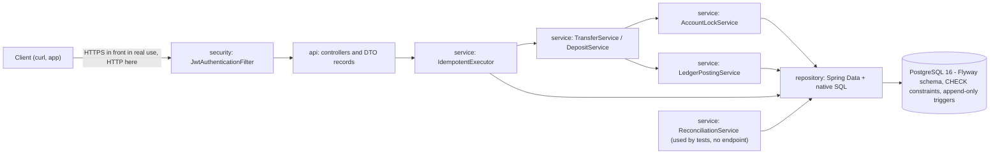
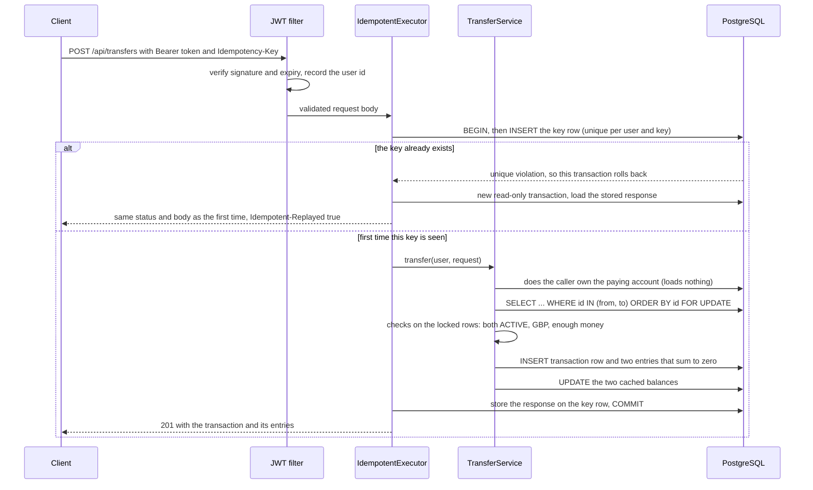

# Double-Entry Payments Ledger Service

A Java 21 / Spring Boot backend that records money moving between accounts the way a bank's books do: every movement is written as balanced double-entry lines that add up to zero, and the history is append-only. It has a REST API with registration and login, accounts, simulated deposits and transfers between accounts. It is built to stay correct when many requests arrive at once, when a client retries the same request, and when something fails half way through. The ledger of entries is the source of truth. Each account also keeps a cached balance so reads are fast, but the cache only ever changes in the same database transaction as the entries it reflects, and a reconciliation check compares the two.

It is a learning project, built to understand and demonstrate the hard parts of payments code (concurrency, idempotency, atomicity, immutability) with tests that run against a real PostgreSQL database, not a mock. Read the [honest scope](#honest-scope-and-known-limitations) before anything else if you are evaluating it.

## What works

- Register and log in (`POST /api/auth/register`, `POST /api/auth/login`). Passwords are stored as BCrypt hashes; login returns a signed JWT sent as `Authorization: Bearer <token>`.
- Open, list and view GBP accounts. A user only ever sees their own accounts; someone else's account looks exactly like a missing one (404).
- Deposits (simulated: money appears from an `EXTERNAL_FUNDING` system account) and transfers between customer accounts. Both are balanced double-entry, atomic, and refuse to overdraw (422).
- Every deposit and transfer requires an `Idempotency-Key` header. Repeating the same request returns the stored response and moves money once.
- Errors come back as RFC 7807 `application/problem+json`.

## Architecture



Controllers are thin (JSON in, JSON out, validation). Business rules live in `service`. `LedgerPostingService` is the only code that writes ledger entries or changes a cached balance, and `AccountLockService` is the only code that locks accounts. Package layout: `api`, `domain`, `service`, `repository`, `security`, `config` under `src/main/java/dev/joseph/ledger/`. The data model diagram is in [docs/architecture.md](docs/architecture.md).

### Lifecycle of a transfer request



Any exception before the COMMIT rolls back the key row, the entries and the balance changes together, so a failed transfer leaves nothing behind and the client can retry with the same key.

## The six invariants and the tests that prove them

Every test named here runs against a real PostgreSQL 16 container (Testcontainers), except the classes marked "unit". The tests are in `src/test/java/dev/joseph/ledger/`.

| # | Invariant | How it is enforced | Test classes that prove it |
|---|-----------|--------------------|----------------------------|
| 1 | Every transaction's entries sum to zero | The posting service refuses any set of lines that does not sum to zero. The database does not enforce this rule ([docs/DECISIONS.md](docs/DECISIONS.md), entry 17). | [`MoneyMovementIntegrationTest`](src/test/java/dev/joseph/ledger/MoneyMovementIntegrationTest.java) (sums per transaction in SQL, posting guard, `mixedSequenceKeepsEveryInvariant`), [`ReconciliationIntegrationTest`](src/test/java/dev/joseph/ledger/ReconciliationIntegrationTest.java) (detects an unbalanced transaction) |
| 2 | The sum of all entries is zero | Follows from 1; checked by reconciliation | [`ConcurrentTransferShowcaseIntegrationTest`](src/test/java/dev/joseph/ledger/ConcurrentTransferShowcaseIntegrationTest.java), [`DeadlockIntegrationTest`](src/test/java/dev/joseph/ledger/DeadlockIntegrationTest.java), [`ReconciliationIntegrationTest`](src/test/java/dev/joseph/ledger/ReconciliationIntegrationTest.java) |
| 3 | A customer balance never goes below zero | Funds check on the locked row, plus a `CHECK (balance_minor >= 0)` as backstop | [`MoneyMovementIntegrationTest`](src/test/java/dev/joseph/ledger/MoneyMovementIntegrationTest.java) (overdraft is 422, exact balance allowed), [`LedgerConstraintsIntegrationTest`](src/test/java/dev/joseph/ledger/LedgerConstraintsIntegrationTest.java) (the CHECK itself), the concurrency showcase (no negative balance after 1,000 racing transfers) |
| 4 | Entries are immutable | PostgreSQL triggers reject `UPDATE`, `DELETE` and `TRUNCATE` on `ledger_entries`; the entity is `@Immutable`; the repository exposes no delete | [`ImmutabilityTriggerIntegrationTest`](src/test/java/dev/joseph/ledger/ImmutabilityTriggerIntegrationTest.java), [`ImmutableRepositoryShapeTest`](src/test/java/dev/joseph/ledger/ImmutableRepositoryShapeTest.java) (unit), [`TestIsolationIntegrationTest`](src/test/java/dev/joseph/ledger/TestIsolationIntegrationTest.java) |
| 5 | A request retried with the same idempotency key executes at most once | A unique database constraint on `(user_id, idem_key)`, with the key row inserted first in the business transaction | [`ConcurrentIdempotencyIntegrationTest`](src/test/java/dev/joseph/ledger/ConcurrentIdempotencyIntegrationTest.java) (20 identical simultaneous requests, one transaction), [`IdempotencyApiIntegrationTest`](src/test/java/dev/joseph/ledger/IdempotencyApiIntegrationTest.java), [`IdempotencyServiceIntegrationTest`](src/test/java/dev/joseph/ledger/IdempotencyServiceIntegrationTest.java), [`IdempotencyExpiryIntegrationTest`](src/test/java/dev/joseph/ledger/IdempotencyExpiryIntegrationTest.java), [`RequestHasherTest`](src/test/java/dev/joseph/ledger/RequestHasherTest.java) (unit) |
| 6 | A transfer is atomic | One `@Transactional` unit; helpers are `Propagation.MANDATORY` so a missing transaction fails loudly | [`AtomicityIntegrationTest`](src/test/java/dev/joseph/ledger/AtomicityIntegrationTest.java) (crashes after the writes were flushed, then finds nothing left) |

Supporting tests: [`AccountLockServiceIntegrationTest`](src/test/java/dev/joseph/ledger/AccountLockServiceIntegrationTest.java) (the emitted SQL, and a second session really blocked), [`DeadlockMutationIntegrationTest`](src/test/java/dev/joseph/ledger/DeadlockMutationIntegrationTest.java) (proves the deadlock test can fail), [`AuthApiIntegrationTest`](src/test/java/dev/joseph/ledger/AuthApiIntegrationTest.java) and [`JwtSecretFailFastTest`](src/test/java/dev/joseph/ledger/JwtSecretFailFastTest.java) (login, tampered and expired tokens, ownership).

Tests that were made to fail on purpose, to show they can:
- The 1,000-transfer showcase was committed failing against the earlier non-locking version, then passed after the lock was added. The failing run is saved in [docs/evidence/phase-4-red-naive-lock.txt](docs/evidence/phase-4-red-naive-lock.txt): cached balances added up to 148,784 pence when 100,000 existed, with no exception anywhere.
- A test-only lock service that locks accounts in alternating order produces PostgreSQL deadlock aborts (`DeadlockMutationIntegrationTest`).
- With the idempotency key made unique per request (so the constraint cannot fire), 20 identical transfers ran 20 times instead of once ([docs/evidence/phase-5-repeat-runs.txt](docs/evidence/phase-5-repeat-runs.txt)). That was a manual check, reverted, and is not automated.

What is not built, stated plainly: there are **no reversals**, no audit log and no admin reconciliation endpoint (they were deliberately left out to keep the project small). The schema still contains the `REVERSAL` transaction type, a unique link so a transaction could be reversed at most once, and an `audit_log` table, but no code uses them. Invariant 4 is enforced by the database triggers and tested; the way a mistake would be corrected (a new reversing transaction, never an edit) is a design intention that is listed as a possible extension, not something you can call.

## Failure modes

**The server crashes in the middle of a transfer.** The transaction row, both entries and both balance updates are inside one database transaction. If the process dies before the COMMIT, PostgreSQL rolls the whole thing back and none of it is visible. `AtomicityIntegrationTest` forces a crash after the writes were flushed to the database and checks that no entry, no transaction row and no balance change remain. That test was itself checked by removing `@Transactional` (it then failed); the check was manual, see [docs/CV_EVIDENCE.md](docs/CV_EVIDENCE.md), Phase 3.

**A client retries a request.** The client sends a unique `Idempotency-Key`. The key is inserted first, inside the same transaction as the money movement, under a unique constraint. If the first attempt committed, the retry gets the stored response (marked `Idempotent-Replayed: true`) and no second transaction is created. If the first attempt failed (for example insufficient funds), everything including the key rolled back, so the retry runs again. The same key with a different request body is refused with 422. Twenty identical requests fired at the same instant create exactly one ledger transaction (`ConcurrentIdempotencyIntegrationTest`).

**Two transfers hit the same account at the same time.** Without protection both read the same balance and one write overwrites the other (a lost update), and the funds check can pass on a stale number. Every deposit and transfer locks the accounts it touches with one `SELECT ... WHERE id IN (...) ORDER BY id FOR UPDATE`. The second request waits, then reads the committed balance. Locking in id order in a single statement also means opposite transfers (A to B and B to A) cannot deadlock. See [docs/DECISIONS.md](docs/DECISIONS.md), entries 23 and 24, for why this was chosen over optimistic locking and SERIALIZABLE.

**A reversal of an already-spent deposit** (a case the original brief asks about) is not covered because reversals are not built.

## Design decisions

The full write-up of each decision, with the options considered and the trade-off, is in [docs/DECISIONS.md](docs/DECISIONS.md). The ones an interviewer is most likely to ask about:

| Decision | Entry |
|----------|-------|
| Stay on Spring Boot 3.5.16 although its open-source support has ended | 1 |
| Append-only entries enforced by database triggers, including `TRUNCATE` | 12 |
| `VARCHAR` plus `CHECK` instead of `CHAR(3)` or native enums | 13 |
| System accounts have no cached balance, so deposits do not contend on one hot row | 15 |
| Tests use unique data per test because the ledger cannot be cleaned | 16 |
| The zero-sum rule is enforced by the service, not the database | 17 |
| One write path for entries and balances | 19 |
| 400 versus 404 versus 422 | 20 |
| Pessimistic row locks under READ COMMITTED, not optimistic locking or SERIALIZABLE | 23 |
| The lock is one native `ORDER BY id FOR UPDATE` query and the first load of the accounts | 24 |
| Reconciliation is set-based, one REPEATABLE READ read-only transaction | 25 |
| Idempotency by unique constraint in a non-transactional executor | 27 |
| Failed attempts are not stored; expired keys are reclaimed by delete-then-insert | 28 |
| jjwt with one hand-written filter, stateless, secret only from the environment | 29 |
| Another user's account is a 404, enforced in the services | 30 |

## Run it locally

Prerequisites: Docker Desktop running, and (for the tests) JDK 21. Check with `java -version` and `docker version`. These commands were run from a fresh `git clone` on Windows 11 in Git Bash, and are the tested route.

**1. Get the code**

```bash
git clone <this repository's URL>
cd <the cloned folder>
```

**2. Start the app and the database**

```bash
export LEDGER_JWT_SECRET="$(openssl rand -base64 48)"   # required: any text of 32+ characters, never commit it
docker compose up --build -d --wait
curl -s http://localhost:8080/actuator/health            # {"status":"UP"}
```

`LEDGER_JWT_SECRET` signs the login tokens and has no default anywhere: Compose stops with an error if it is unset, and the application refuses to start if it is shorter than 32 characters. It must also be set when you run `docker compose down`, because Compose reads the file before it stops anything. The first run builds the image and pulls base images, which takes a couple of minutes. Compose also reads a git-ignored `.env` file if you copy `.env.example` to `.env` and replace the placeholder (Compose supports this, but the clean-clone check used the exported variable).

Windows notes:
- Use Git Bash for the commands in this README. In PowerShell, `curl` is an alias for a different command (use `curl.exe`), and the equivalent for the secret is `$env:LEDGER_JWT_SECRET = "<32 or more characters>"` (not run in the clean-clone check).
- If `docker` is not found in Git Bash, add it for the session: `export PATH="/c/Program Files/Docker/Docker/resources/bin:$PATH"`.

**3. Try the API**

```bash
B=http://localhost:8080; J='Content-Type: application/json'
curl -s -X POST $B/api/auth/register -H "$J" -d '{"username":"alice","password":"correct-horse-battery"}'
TOKEN=$(curl -s -X POST $B/api/auth/login -H "$J" -d '{"username":"alice","password":"correct-horse-battery"}' | sed 's/.*"accessToken":"\([^"]*\)".*/\1/')
curl -s -X POST $B/api/accounts -H "Authorization: Bearer $TOKEN" -H "$J" -d '{"name":"Current"}'
# note the "id" of that account (and of a second one), then:
curl -s -X POST $B/api/deposits  -H "Authorization: Bearer $TOKEN" -H "$J" -H "Idempotency-Key: dep-1" \
  -d '{"accountId":"<account id>","amountMinor":10000,"currency":"GBP"}'
curl -s -X POST $B/api/transfers -H "Authorization: Bearer $TOKEN" -H "$J" -H "Idempotency-Key: tr-1" \
  -d '{"fromAccountId":"<id 1>","toAccountId":"<id 2>","amountMinor":2500,"currency":"GBP"}'
```

Amounts are whole pence (`10000` is 100.00 GBP). Send the transfer again with the same `Idempotency-Key` and you get the same response with an `Idempotent-Replayed: true` header and the balances do not move twice. Ask for more than the balance and you get a 422. There is no Swagger UI (OpenAPI documentation is a possible extension).

**4. Stop and delete everything, including the database volume**

```bash
docker compose down -v
```

## Run the tests

You need JDK 21 and Docker Desktop running. The first run pulls the PostgreSQL image. In Git Bash, point `JAVA_HOME` at your JDK 21 (Gradle needs it and Git Bash often does not set it):

```bash
export JAVA_HOME="/c/Program Files/Eclipse Adoptium/jdk-21.0.12.101-hotspot"   # adjust to your install
./gradlew cleanTest test
```

PowerShell: `$env:JAVA_HOME = "C:\Program Files\Eclipse Adoptium\jdk-21.0.12.101-hotspot"` then `.\gradlew.bat cleanTest test` (not run in the clean-clone check). `cleanTest` matters: without it Gradle can skip tests it considers up to date. `./gradlew build` also works and takes about a minute on a laptop with Docker running. The tests do not need `LEDGER_JWT_SECRET` (the test profile has its own fake key), and they pass with it set. Results: `build/reports/tests/test/index.html` and `build/test-results/test/*.xml`. More detail and troubleshooting: [docs/LEARNING_NOTES.md](docs/LEARNING_NOTES.md).

## Test evidence

From the final full run (`./gradlew cleanTest test --console=plain`, exit code 0, BUILD SUCCESSFUL), counted by a script from every `build/test-results/test/*.xml` file:

| Category | Tests | Skipped | Failed | Errors |
|----------|-------|---------|--------|--------|
| Integration (`*IntegrationTest`, real PostgreSQL via Testcontainers) | 171 | 1 | 0 | 0 |
| Unit (`*Test`) | 17 | 0 | 0 | 0 |
| **Total** | **188** | **1** | **0** | **0** |

The one skipped test is `LockingOffDemoIntegrationTest`, disabled on purpose: it is a demonstration that the 1,000-transfer load *fails* when locking is switched off, kept as documentation. `JwtSecretFailFastTest` is counted as a unit test by its name although it also starts the real application.

Concurrency showcase: 1,000 random transfers of 1 to 5,000 pence between 10 accounts (each funded with 10,000 pence), from 16 threads released together, seeded random inputs (seed 20260929), then no negative balance, money conserved and every cached balance equal to its entries. Six consecutive runs of the concurrency and locking test classes all passed; 20 identical simultaneous transfer requests created one ledger transaction in each of five consecutive runs. Interleavings differ from run to run, so this is repeated evidence and not a proof. The raw output and every figure's source are in [docs/CV_EVIDENCE.md](docs/CV_EVIDENCE.md) and [docs/evidence/](docs/evidence/); the final run is [docs/evidence/final-test-output.txt](docs/evidence/final-test-output.txt).

Nothing was measured for throughput or latency; there are no performance claims.

## Honest scope and known limitations

- This is a learning project and not production-grade.
- Single currency: GBP only, amounts held as whole pence in a `long`.
- Deposits are simulated. There are no real payment rails, no open banking and no connection to any bank or card network.
- Spring Boot 3.5.16 is the last 3.x release and its open-source support ended on 2026-06-30, so the framework gets no free security patches. This was a deliberate choice ([docs/DECISIONS.md](docs/DECISIONS.md), entry 1); upgrading to Boot 4.1.x is a possible next step.
- Authentication is basic: a JWT is valid until it expires (1 hour by default) with no refresh tokens, no logout or revocation, no login rate limiting or lockout, registration reveals whether a username is taken, and there is no HTTPS in front of the app.
- Concurrency is tested against one PostgreSQL instance through the service layer (and the idempotency tests through MockMvc), not over real HTTP sockets and not across several application instances. Pessimistic locking limits throughput on a single very busy account.
- Reconciliation exists as a service used by the tests, with no HTTP endpoint. In tests it runs over the rows each test created, because the shared test database also holds other tests' deliberately corrupted rows.
- The append-only triggers stop application bugs and casual SQL, not a privileged database administrator (the table owner can disable them).
- Idempotency covers deposits and transfers; expired keys are not cleaned up by a job; a replayed body equals the original as JSON but is not byte-identical (stored as JSONB); a duplicate waits inside the database and holds a connection while it does.
- The GitHub Actions workflow ([.github/workflows/ci.yml](.github/workflows/ci.yml)) is committed but has not yet been observed running: the repository has not been pushed anywhere, so no CI result is claimed.
- The database credentials in `docker-compose.yml` (`ledger` / `ledger`) are local-development defaults, and the ports are bound to `127.0.0.1`.
- Not built and not claimed: reversals, an audit log, an admin reconciliation endpoint, OpenAPI/Swagger documentation, structured JSON logging, load testing.

## Possible extensions

- Reversals (a new mirror-image transaction linked to the original, at most once), transaction history with paging.
- An audit log of money movements and denied access, using the table that already exists.
- An admin reconciliation endpoint, and a scheduled reconciliation job.
- Multi-currency and FX; real payment rails or open banking.
- OpenAPI/Swagger documentation.
- Refresh tokens and revocation, login rate limiting, HTTPS.
- A cleanup job for expired idempotency keys.
- Deployment to AWS or Azure (below), and an upgrade to Spring Boot 4.1.x.

## How this would run on AWS or Azure

This is a description, not something that was built or tested; nothing here has been deployed anywhere. The application is already a container image (see the `Dockerfile`), so the natural shape is: run the image on a managed container service (on AWS, ECS on Fargate or App Runner; on Azure, Container Apps), with a managed PostgreSQL 16 in place of the Compose database (RDS or Aurora on AWS, Azure Database for PostgreSQL). The JWT secret and database password would come from the platform's secrets manager (AWS Secrets Manager, Azure Key Vault) and be injected as the same environment variables the app already reads (`LEDGER_JWT_SECRET`, `SPRING_DATASOURCE_*`), instead of a file. The platform's health check would call `/actuator/health`. Flyway already applies migrations at startup. Things that would need real work first: HTTPS termination, a limit on connection-pool size against the database's connection limit (the idempotency design holds a connection while a duplicate waits), the append-only triggers being protected by separate database roles, monitoring, and load testing, none of which exist here.

## Documentation

- [docs/INTERVIEW_PREP.md](docs/INTERVIEW_PREP.md): a study guide. Start with "Read this first"; it has the 90-second pitch, the model answers to the interview questions, the walkthroughs of the files that matter and a glossary.
- [docs/DECISIONS.md](docs/DECISIONS.md): every non-obvious decision with options, choice and trade-off.
- [docs/architecture.md](docs/architecture.md): the data model diagram and why the entries are the source of truth.
- [docs/LEARNING_NOTES.md](docs/LEARNING_NOTES.md): project layout, what Spring Boot auto-configures, and the Spring concepts used, in plain words.
- [docs/CV_EVIDENCE.md](docs/CV_EVIDENCE.md): verified facts and test counts per phase, each backed by saved command output in [docs/evidence/](docs/evidence/).
- [docs/CV_BULLETS.md](docs/CV_BULLETS.md): CV wording drawn only from that evidence.
