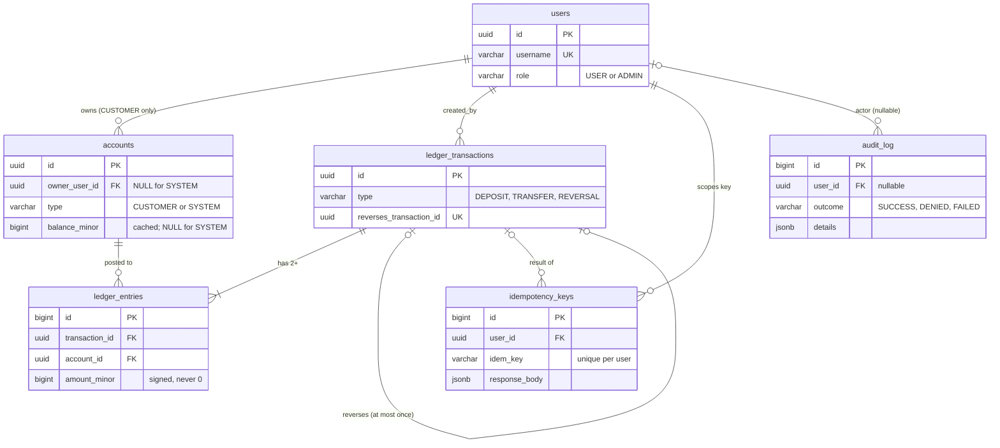

# Architecture

This page describes the data model as built in Phase 2 (schema, triggers and domain model). Services, controllers and security come in later phases and are not described here.

## Data model

All money is `BIGINT` minor units (pence), GBP only. Every constraint has an explicit name (for example `uq_idempotency_user_key`, `uq_ledger_tx_reverses`, `ck_accounts_balance_nonneg`) because later phases recognise a violation by its SQLSTATE and constraint name, and the tests assert those names.

Two accounts are seeded by migration V4 with fixed ids: `EXTERNAL_FUNDING` (`00000000-0000-0000-0000-000000000001`) and `EXTERNAL_PAYOUTS` (`...0002`). They are `SYSTEM` accounts with no owner and no cached balance, so they are never updated and never become a hot row that every deposit would contend on.

## Why the ledger entries are the source of truth

A balance is a fact about history: it is the sum of every entry ever posted to the account. The entries table records that history, one signed amount per line, and it is append-only. Database triggers reject `UPDATE`, `DELETE` and `TRUNCATE` on `ledger_entries` and `audit_log`, so history cannot be rewritten by a buggy code path or by SQL run outside the application. A mistake is corrected by posting a new `REVERSAL` transaction, never by editing an old one.

The `balance_minor` column on a customer account is a cache of that sum, kept so a balance read does not have to add up every entry. It is only changed in the same database transaction as the entries it reflects, and a `CHECK` stops it going negative. Because it is a cache it can in principle be wrong (a bug, a manual edit), so it is never trusted over the entries: reconciliation (Phase 4) recomputes each balance from the entries and reports any account where the two differ. If they disagree, the entries win.

## What the database enforces, and what it does not

| Rule | Enforced by |
|------|-------------|
| Entries and audit rows are never changed or removed | Triggers in V3 (row-level for update and delete, statement-level for truncate) |
| A customer balance is never negative | `ck_accounts_balance_nonneg` |
| SYSTEM accounts have no owner and no cached balance; CUSTOMER accounts have both | `ck_accounts_owner_shape`, `ck_accounts_balance_shape` |
| No zero-value entries | `ck_entries_amount_nonzero` |
| A transaction is reversed at most once | `uq_ledger_tx_reverses` |
| A client's idempotency key is used at most once | `uq_idempotency_user_key` |
| **Each transaction's entries sum to zero** | **Not the database.** Enforced by the posting service (Phase 3) and checked by reconciliation (Phase 4). A deferrable zero-sum constraint trigger is a stretch item that has not been built. |

The honest limit of the triggers: the table owner or a superuser can disable them or drop the table. They stop application bugs and casual SQL, not a privileged database administrator. See docs/DECISIONS.md.
